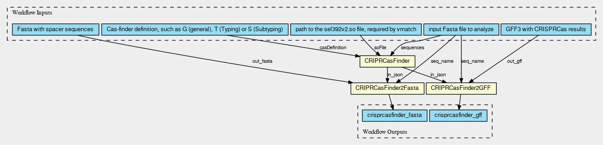

[](https://github.com/EBI-Metagenomics/crispr_template/actions/workflows/test.yml)

# CRISPRCasFinder

Workflow to run CRISPRCasFinder and generate fasta file of spacer sequences and an accompanying gff file

## Setup

To install the pipeline we recommend Conda to manage the enviroment. You will require docker or singularity to run 
this workflow.

## Python dependencies

```python
$ pip install -r requirements-dev.txt
```

### Pre-commit hooks

Setup the git [pre-commit hook](https://pre-commit.com/):

```bash
pre-commit install
```

*Why?*

pre-commit will run a set of pre-configured tools before allowing you to commit files. You can find the currently configure hooks and configurations in [.pre-commit-config.yaml](./.pre-commit-config.yaml)

## Workflow


# Tests

CWL tests are executed with [cwltest](https://github.com/common-workflow-language/cwltest).

Run:
```bash
cd tests
./cwltest.sh
```